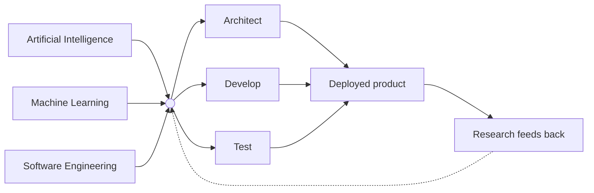

<picture>
  <source media="(prefers-color-scheme: dark)" srcset="assets/banner-dark.svg">
  <source media="(prefers-color-scheme: light)" srcset="assets/banner-light.svg">
  
</picture>

 

### We build AI products end to end — the models, the APIs that serve them, and the systems around them.

 

 

## Who we are

Karmat Engineering Limited is an AI product company in **Akure, Nigeria**.

We take a problem from research through to something with a URL, an uptime number, and people depending on it. Not a demo, not a notebook — the model, the API in front of it, and the product around both. Everything below is running in production or actively in training.

 

## What we build

<table>
<tr>
<td width="50%" valign="top">

### 👁 Optical Diagnostics
**Clinical decision support for ophthalmology**

Reads clinical features, fundus and OCT imagery, or all of them together, and returns a ranked condition with its probability distribution and a suggested next step.

`🟢 Live` · [Application](https://diagnostics.karmat-hq.com) · [API docs](https://api-diagnostics.karmat-hq.com/api/docs)

</td>
<td width="50%" valign="top">

### 📖 Seerah AI
**Islamic answers, grounded in their sources**

Retrieval-augmented Q&A across the Quran, Hadith, scholarly fatwa and Seerah history. Every answer returns the passages it was built from, so a reader can verify it rather than take it on trust.

`🟢 Live` · [Application](https://seerahai.karmat-hq.com) · [API docs](https://api-seerahai.karmat-hq.com/docs)

</td>
</tr>
<tr>
<td width="50%" valign="top">

### 🪪 Attender
**Attendance you can actually rely on**

Face-verified attendance for schools and teams — enrolment, session capture, roster management and reporting.

`🟢 Live` · `⚙️ API in development` · [Application](https://attender.karmat-hq.com)

</td>
<td width="50%" valign="top">

### 🔊 K-TTS
**Trilingual speech synthesis**

A text-to-speech model for English, Arabic and Yoruba — three languages that general-purpose voices handle poorly together.

`🟡 In training` · [Read more](https://www.karmat-hq.com/en/products)

</td>
</tr>
</table>

> [!IMPORTANT]
> **Optical Diagnostics is clinical decision support, not a diagnosis.** It is not a medical device certified for autonomous use. Every response carries a disclaimer that must be surfaced wherever the result is shown, and a qualified clinician reviews any output before it informs patient care.

 

## How we work

Three disciplines converge on one root, then branch through architecture, development and testing into something deployed. Every branch is a stage we can point at, review, and hand back to you.

 

<b>&nbsp;⟩&nbsp; Working with us</b>

 

We design and build AI systems end to end — on **Azure**, on **AWS**, or on your own infrastructure. Model selection, retrieval and grounding, evaluation, deployment, and the operational work that keeps a system honest after launch.

Our [documentation](https://www.karmat-hq.com/en/docs) sets out the same process we run on client work: how we scope a problem, how we choose between a hosted model and a fine-tune, and the checklist we complete before anything takes real traffic.

If you have a problem that looks like ours, [start a conversation](https://www.karmat-hq.com/en/contact).

<b>&nbsp;⟩&nbsp; Getting API access</b>

 

Access is **reviewed, not self-serve**.

1. Submit a request describing what you are building and roughly how much traffic you expect.
2. We approve or decline it.
3. On approval the key is shown **exactly once**.

Keys are stored only as a hash — if you lose one you rotate it, you don't recover it. Authentication is a single `X-API-Key` header across every published API.

Content you send is processed to produce your response and is **not** used to train our models without a separate written agreement. Request and response bodies are not retained in our logs by default.

→ [Access and API keys](https://www.karmat-hq.com/en/docs/access)

<b>&nbsp;⟩&nbsp; Three languages, properly</b>

 

Our products and documentation are published in **English**, **Arabic** and **Yoruba** — all three as first-class languages, not an afterthought.

Arabic is genuinely right-to-left rather than a mirrored stylesheet. Yoruba keeps its diacritics, because tone marks are meaning and not decoration. K-TTS is being trained on native-speaker recordings in all three, evaluated per language rather than on a single aggregate score.

<b>&nbsp;⟩&nbsp; About these repositories</b>

 

Product source lives in **private repositories** in this organisation. What we publish instead is documentation: every live API is fully specified, with request and response schemas, error semantics, rate limits and worked examples.

→ [Documentation](https://www.karmat-hq.com/en/docs) · [Optical Diagnostics API](https://api-diagnostics.karmat-hq.com/api/docs) · [Seerah AI API](https://api-seerahai.karmat-hq.com/docs)

 

**[Website](https://www.karmat-hq.com)** &nbsp;·&nbsp; **[Documentation](https://www.karmat-hq.com/en/docs)** &nbsp;·&nbsp; **[Products](https://www.karmat-hq.com/en/products)** &nbsp;·&nbsp; **[Contact](https://www.karmat-hq.com/en/contact)**

**[X](https://x.com/karmat_hq)** &nbsp;·&nbsp; **[LinkedIn](https://www.linkedin.com/company/karmat-engineering-limited/)** &nbsp;·&nbsp; **[info@karmat-hq.com](mailto:info@karmat-hq.com)**

 

Built in Akure, Nigeria &nbsp;·&nbsp; © Karmat Engineering Limited

